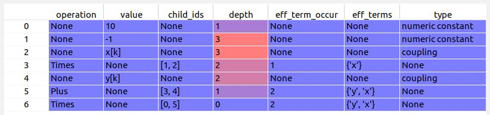

Mathematica Parser: Translate mathematica expressions into any programming language
=================

The python library parses mathematical functions that are exported from mathematica. The mathematical operations are represented within the flow_equation_parser.py file as a tree. This tree can be used to generate code in any programming language to perform the same mathematical operation. We do this here on the example of a set of ordinary differential equations and convert the equation into Thrust code that can be run with CUDA on a GPU.

Basic Example
-------------

We consider as and example a lorentz attractor:

<a href="https://www.codecogs.com/eqnedit.php?latex=\begin{align}&space;\dot{x}&=\sigma(y&space;-&space;x)&space;\nonumber\\&space;\dot{y}&=x(\rho-z)&space;-&space;y&space;\nonumber\\&space;\dot{z}&=xy&space;-&space;\beta&space;z\nonumber&space;\end{align}" target="_blank"></a>

with:

<a href="https://www.codecogs.com/eqnedit.php?latex=\sigma=10\text{,}\;\rho&space;=&space;28\text{,}\;\beta=8/3" target="_blank"></a>

which results in a chaotic solution.

The equations are exported from the Mathematica file with the FullForm (see mathematica_notebooks/lorentz_attractor.nb). The resulting output is (see examples/flow_equations/lorentz_attractor):

```text
List[Equal[Derivative[1][x][k], Times[10.`, Plus[Times[-1, x[k]], y[k]]]], Equal[Derivative[1][y][k], Plus[Times[-1, y[k]], Times[x[k], Plus[28.`, Times[-1, z[k]]]]]], Equal[Derivative[1][z][k], Plus[Times[x[k], y[k]], Times[Rational[-8, 3], z[k]]]]]
```
Note that in this case k refers to the time.

The python code in flow_euquation_parser.py generates a tree in a pandas dataframe out of this expression (example for the first ordinary differential equation):



Based on this tree, thrust cuda code is generated with the help of the code in thrust_meta_programmer.py

```c++
struct LorentzAttractorFlowEquation0 : public FlowEquation
{
	LorentzAttractorFlowEquation0(const cudaT k_) : k(k_)
	{}

	void operator() (DimensionIteratorC &derivatives, const DevDatC &variables) override
	{
		thrust::transform(variables[0].begin(), variables[0].end(), variables[1].begin(), derivatives.begin(), [] __host__ __device__ (const cudaT &val1, const cudaT &val2) { return 10 * ((-1 * val1) + val2); });
	}

private:
	const cudaT k;

};
```

The computation of the first ordinary differential equation can be recognized in the lambda expression of the flow equation.

Support and Development
----------------------

An executable example will follow soon. If you want to use the project already, do not hesitate to contact us per mail for help: statphysandml@thphys.uni-heidelberg.de.
